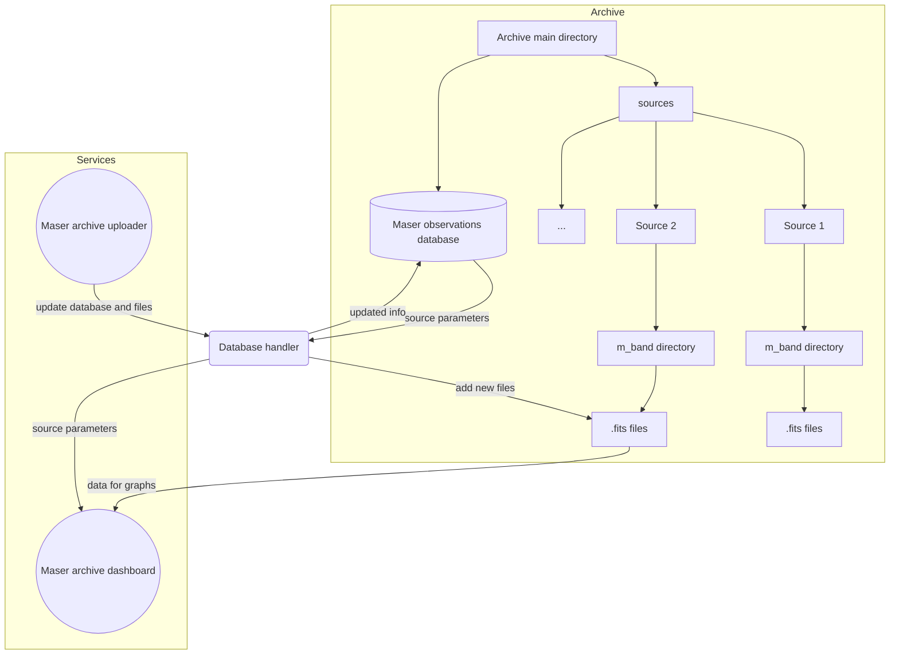

# Maser archive dashboard
This is a maser archive dashboard. Written using streamlit framework
## Target platform
Gnu/Linux
## Requirements
App is tested under git version 2.34.1 and python 3.10.
Python 3.8 and newer should be fine (but it is not guaranteed).
## Setting up the repository
```bash
git clone https://github.com/dachshund-ncu/maser-archive-dashboard.git
git submodule init
git submodule update
```
## Installing depedencies
```bash
sudo apt install libbz2-dev
sudo apt install gfortran
python3 -m pip install --upgrade pip
python3 -m pip install -r requirements.txt
```

## Runing the archive
### Dashboard
```bash
streamlit run maser_archive.py
```
### Uploader
```bash
streamlit run maser_uploader.py
```

# Dashboard working flowchart
